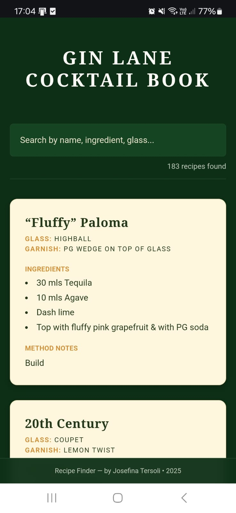
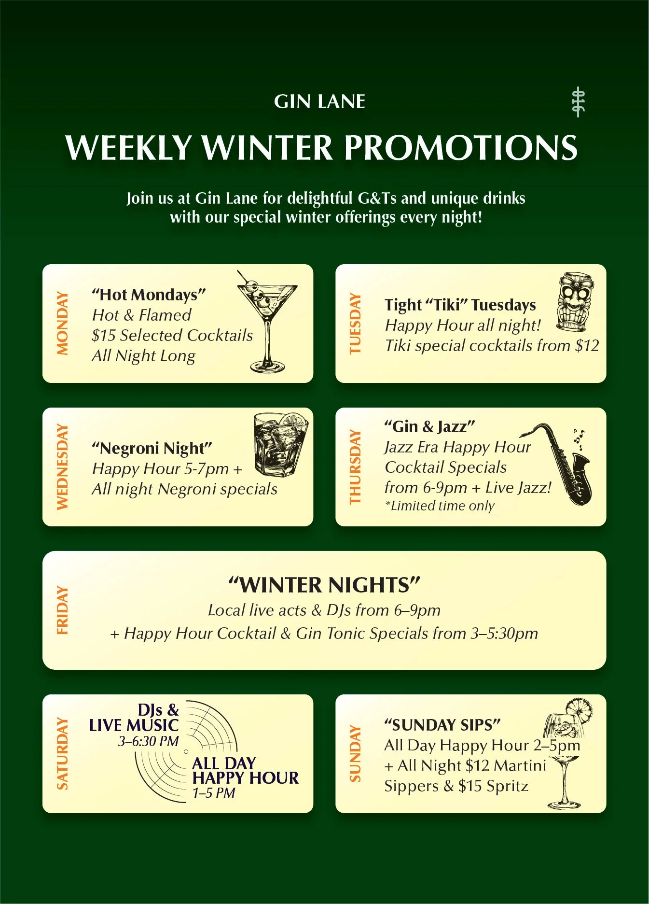

# Gin Lane Cocktail Book 🍸

A fast and searchable cocktail recipe book built for **Gin Lane (Sydney)**.

This project was created to support **staff training and daily operations**, since the venue manages ~200 cocktails and new team members need quick access to recipes, ingredients, glassware and garnish details.

The recipe database is connected to **Google Sheets via SheetDB**, so the bar manager can update recipes easily without touching the code.

🔗 **Live App:** https://gl-recipes.vercel.app/

---

## Preview



---

## Features

- ✅ Search by **cocktail name**
- ✅ Search by **ingredient**
- ✅ Search by **glassware**
- ✅ Search by **garnish**
- ✅ Responsive design (mobile + desktop)
- ✅ Connected to Google Sheets for easy updates
- ✅ Back-to-top button for long scrolling menus

---

## Data Source

Recipes are stored in **Google Sheets** and fetched via **SheetDB API**.

This allows non-technical users to update the cocktail database in real time.

---

## Design Inspiration

The UI was inspired by Gin Lane’s printed menu style to keep a consistent brand look and feel.



---

## Tech Stack

- React + Vite
- TailwindCSS
- SheetDB (Google Sheets API wrapper)
- Deployed with Vercel

---

## Run Locally

```bash
npm install
npm run dev
```
